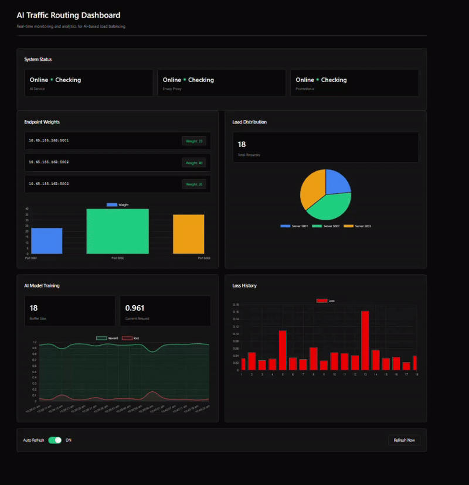

# AI-based Traffic Routing for Multi-Cloud 🚦

A small experimental platform that integrates Envoy, Prometheus, and an AI service to perform continuous, RL-based traffic optimization across backend servers.

---

## 🔎 Project Overview

This project demonstrates an intelligent traffic routing system that:

- Uses Envoy as an edge proxy and HTTP load balancer (localhost:80)
- Collects metrics via Prometheus (localhost:9090)
- Runs an AI service (gRPC + Flask) that observes metrics, learns a policy, and updates Envoy via the xDS API (localhost:50051)
- Routes traffic to your backend servers (example IPs: `10.0.195.3:5000-5002`)

---

## 🧩 System Components

- **Envoy Proxy** — `BalanceIQ/envoy.yml` (Admin: `http://localhost:9901`, Proxy: `http://localhost:80`) 🔧
- **Prometheus** — `DETO/DETO/prometheus.yml` (UI: `http://localhost:9090`) 📊
- **AI Service** — `menDu/` (gRPC xDS server + Flask API; AI optimization) 🤖
- **Backend servers** — configured in `menDu/config.py` (default: `10.0.195.3:5000-5002`) 🖥️

---

## 📖 How it works

1. Envoy sends per-cluster / per-endpoint metrics to Prometheus.
2. The AI service periodically queries Prometheus (P95 latency, error rate, saturation, throughput).
3. A CFR-RL style policy (see `menDu/cfr_rl/`) computes better weights for endpoints.
4. The AI service pushes those weights to Envoy using xDS (gRPC endpoint defined in `menDu/xds/server.py`).
5. Envoy applies the new weights and traffic shifts toward healthier endpoints; the system learns over time.

> Full project description: see `CC Project.pdf` (included in repo).

---

## 📊 Project Dashboard



(Animated GIF showing the dashboard / monitoring UI is located at `dashboard.gif`.)

---

## 🔧 Configuration

- **Backend Servers**: Edit `menDu/config.py` to change server IPs and Prometheus hostname/port.
- **Envoy Config**: Modify `BalanceIQ/envoy.yml` to change routing rules, clusters, and admin port.
- **Prometheus**: Update `DETO/DETO/prometheus.yml` for scrape jobs and targets.

Key config variables in `menDu/config.py`:

- `BACKEND_SERVER_IPS` — map of `"ip:port": weight`
- `PROMETHEUS_IP`, `PROMETHEUS_PORT` — where Prometheus is reachable from the AI service
- `OPTIMIZATION_INTERVAL_SECONDS` — how often AI re-evaluates the cluster

---

## ▶️ Quickstart (development)

Prereqs: Python 3.10+, Docker (if using containers), `pip`.

1. Clone the repo and enter project root.
2. Install Python deps for AI service:

```bash
python -m pip install -r menDu/requirements.txt
```

3. Run Prometheus and Envoy (example with Docker or your preferred method). The included `BalanceIQ/run.txt` shows a sample `docker-compose up -d` flow.

4. Start the AI service (dev):

```bash
cd menDu
python main.py
```

5. Check the AI service health and metrics:

```bash
curl http://localhost:5000/api/health
curl http://localhost:5000/api/metrics/all
```

6. Point your clients at Envoy: `http://localhost:80`

---

## 🧾 Monitoring & Logs

- Envoy Admin: http://localhost:9901 ✅
- Prometheus UI: http://localhost:9090 ✅
- AI service metrics endpoints: `http://localhost:5000/api/metrics/*` ✅
- Tail logs (if using Docker):

```bash
docker-compose logs -f [service_name]
# or
docker logs -f [container_id]
```

---

## 🎯 AI Optimization (summary)

The AI service continuously:

- Monitors latency, error rates, saturation, and throughput
- Learns optimal traffic distribution policies with CFR-RL components
- Dynamically adjusts per-endpoint load balancing weights via xDS
- Seeks to minimize latency and errors while keeping throughput high

---

## ✅ Testing & Validation tips

- Use synthetic load (e.g., `hey`, `wrk`, `ab`) to generate traffic and observe Prometheus metrics.
- Validate that xDS updates appear in Envoy admin (`/clusters` and `/stats`) after the AI service pushes changes.
- Check `menDu/api_server.py` metrics to ensure the AI service is recording rewards, training iterations, and weights.

---

## ⚠️ Troubleshooting

- If Envoy shows no endpoints, confirm the AI xDS server is reachable and properly advertising the `my_service` cluster.
- If Prometheus queries return empty results, verify `PROMETHEUS_IP` in `menDu/config.py` and Prometheus scrape configs.
- If the AI service cannot start, check `menDu/requirements.txt` and Python version compatibility.

---

## 🔒 Security & Operational Notes

- Run Envoy admin behind a protected interface in production.
- Secure gRPC (xDS) using TLS and mTLS for production deployments.
- Limit access to Prometheus and the AI service APIs.

---

## 📚 References

- Envoy xDS & admin docs: https://www.envoyproxy.io/
- Prometheus documentation: https://prometheus.io/docs/
- gRPC: https://grpc.io/
- Reinforcement learning fundamentals: https://www.suttonandbarto.com/

---

## 🤝 Contributing

Contributions are welcome. Please open issues for bugs and feature requests or submit pull requests with tests and documentation.

---

## 📝 License

This project is licensed under the MIT License. See the [LICENSE](https://github.com/PurvalBhude/AI-based-Traffic-Routing-for-Multi-Cloud/blob/main/LICENSE) file for details.

---

If you'd like, I can:
- Add a `docker-compose.yml` example that wires Envoy, Prometheus, AI service, and sample backends, or
- Create a short health-check script that automates a smoke-test for the full pipeline.

Let me know which you'd prefer. ✨

---

Made with ❤️ by Purval Bhude. For more about me and my work, visit my [Portfolio](https://purvalbhude.github.io/Portfolio-Website/) or [LinkedIn](https://www.linkedin.com/in/purvalbhude).